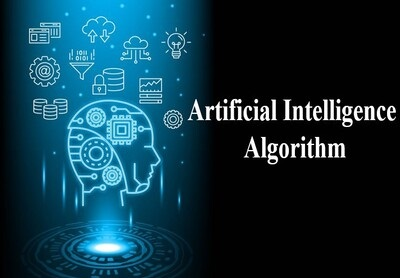

# Artificial Intelligence Algorithms



## Contents

 - [Machine Learning](#ml)
 - [Neural Nets & Deep Learning](#ann-dp)
 - [Deep/+Reinforcement Learning](#drl)
 - [Computer Vision](#cv)
 - [Tips & Tricks](#tips-and-tricks)
 - [Project Settings](#settings)

---

<div id="ml"></div>

## Machine Learning

 - __Machine Learning:__
   - __Classical Learning:__
     - __Supervised Learning:__
       - __Regression:__
         - Linear Regression
           - [Introduction to Linear Regression](modules/linear-regression/intro-to-linear-regression.md)
           - [Gradient Descent Method](modules/linear-regression/gradient-descent-method.md)
           - [Coefficient of Determination (R<sup>2</sup>)](modules/linear-regression/r2.md)
           - [Linear Regression with Scikit-Learn](modules/linear-regression/linear-regression-w-sklearn.md)
         - Polynomial Regression
         - Ridge/Lasso Regression (+Regularization L1 & L2)
         - Elastic Net
       - __Classification:__
         - Logistic Regression
           - [Introduction to Logistic Regression](modules/logistic-regression/intro-to-lr.md)
         - Decision Trees
         - SVM - (Support Vector Machine)
         - Naive Bayes
         - K-Nearest Neighbors - (KNN)
     - __Unsupervised Learning:__
       - __Clustering:__
         - Fuzzy C-Means
         - Mean-Shift
         - K-Means
         - DBSCAN
         - Agglomerative
       - __Dimension Reduction (Generalization):__
         - t-SNE
         - Principal Component Analysis - (PCA)
         - LSA
         - SVD
         - LDA
     - __Pattern Search:__
       - Euclat
       - Apriori
       - FP-Growth
     - __Ensemble Methods:__
       - Stacking  
       - Bagging  
         - Random Forest
       - Booting
         - AdaBoost
         - CatBoost
         - LightGBM
         - XGBoost

---

<div id="ann-dp"></div>

## Neural Networks & Deep Learning

 - __Neural Networks & Deep Learning:__
   - __Neural Networks:__
     - [History & Introduction to Artificial Neural Networks](modules/neural-networks/ann-history-intro.md)
     - [Activation Functions](modules/neural-networks/activation-functions.md)
     - [Neural Networks with Keras](modules/neural-networks/ann-with-keras.md)
   - __Deep Learning:__
     - __Convolutional Neural Networks (CNN):__
   - __Recurrent Neural Netowkrs (RNN):__
     - LSM
     - LSTM
     - GRU
   - __Autoencoders:__
     - seq2seq
   - __Generative Adversarial Networks (GAN):__
   - __Deep Reinforcement Learning:__

---

<div id="drl"></div>

## Deep/+Reinforcement Learning

 - __Reinforcement Learning:__
   - Q-Learning
   - Deep Q-Network - (DQN)
   - SARSA
   - A3C
 - __Deep/+Reinforcement Learning:__

---

<div id="cv"></div>

## Computer Vision

 - **x:**
   - [x](#)

---

<div id="tips-and-tricks"></div>

## Tips & Tricks

 - **Preprocessing:**
   - [Data types](modules/preprocessing/data-types.md)
   - [Missing Data](modules/preprocessing/missing-data.md)
   - [Feature selection - Correlation](modules/preprocessing/correlation.md)
 - **Data Splitting:**
   - [Training vs Test sets](modules/data-splitting/training-vs-test-sets.md)
 - **Cross-Validation:**
   - [K-Fold](modules/cross-validation/k-fold.md)
 - **Mathematics:**
   - Chain Role:
     - [Introduction to The Chain Rule](modules/mathematics/the-chain-rule/intro-to-the-chain-rule.md)

---

<div id="settings"></div>

## Project Settings

To use the project codes just install [requirements.txt](requirements.txt) *(Python>=3.7 is requirement for TensorFlow 2.0)*:

**virtualenv settings:**  
```python
where python3.7 # find python source.

virtual --python="python-source" .
source Script/Active
```

**Installing the Requirements:**  
```python
pip install --upgrade -r requirements.tx
```

**Now, Be Happy!!!** 😬

---

**Rodrigo Leite -** *Software Engineer*
