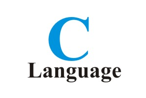

# C

> My **C** Language code examples.

# Contents

 - [Primitive Types](primitive-types)
 - [Strings](string)
 - [Struct](struct)
 - [Pointers](pointers)
 - [Dynamic Memory Allocation](dynamic-allocation)

**Rodrigo Leite -** *Software Engineer*
