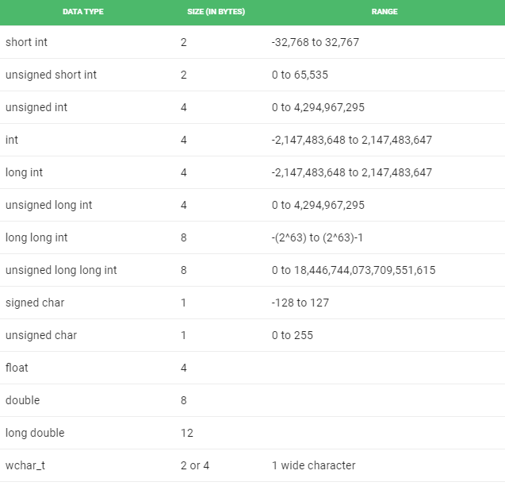

# Data Types

## Contents

 - [01 - Data Types in C++](#01)
 - [02 - Data type modifiers](#02)

---

<div id="01"></div>

## 01 - Data Types in C++

All variables use the data type during the declaration to restrict the type of data to be stored. Therefore, we can say that data types are used to tell variables the type of data it can store. Whenever a variable is defined in **C++**, the compiler allocates some memory for that variable based on the type of data with which it is declared. Every type of data requires a different amount of memory.

  

**NOTE:**  
Data Types in **C++** are mainly divided into three types:

**Primitive data:**  
These data types are internal or predefined data types and can be used directly by the user to declare variables. example: **int**, **char**, **float**, **bool**, etc. The primitive data types available in **C++** are:

 - Integer;
 - Character;
 - Boolean;
 - Floating Point;
 - Double Floating Point;
 - Valueless or Void;
 - Wide Character.

**Derived data:**  
Data types derived from primitive or internal data types are called **Derived data** types. These can be of four types:

 - Function;
 - Array;
 - Pointer;
 - Reference.

**Abstract or User:**  
These data types are user-defined. Like, defining a **class** in **C++** or a **structure**. The **C++** provides the following types of user-defined data:

 - Class;
 - Structure;
 - Union;
 - Enumeration;
 - Typedef defined DataType.

---

<div id="02"></div>

## 02 - Data type modifiers

As the name implies, data type modifiers are used with internal data types to **modify** the **length of data** that a given data type can contain. The data type modifiers available in **C++** are:

 - signed;
 - unsigned;
 - long;
 - shorts.

  

**NOTE:**  
The table below summarizes the **modified size** and **range** of internal data types when combined with the type modifiers:

  

**NOTE:**  
The above values ​​may vary from compiler to compiler. In the above example, we consider the **GCC** of 64 bits.

We can display the size of all data types using the **sizeof()** operator and passing the data type keyword as an argument to this function, as shown below:

[sizeof_types.cc](src/sizeof_types.cc)
```cc
#include <iostream>

using namespace std;

int main()
{
  cout << "Size of char: " << sizeof(char)
  << " byte" << endl;

  cout << "Size of int: " << sizeof(int)
  << " bytes" << endl;

  cout << "Size of short int: " << sizeof(short int)
  << " bytes" << endl;

  cout << "Size of long int: " << sizeof(long int)
  << " bytes" << endl;

  cout << "Size of signed long int: " << sizeof(signed long int)
  << " bytes" << endl;

  cout << "Size of unsigned long int: " << sizeof(unsigned long int)
  << " bytes" << endl;

  cout << "Size of float: " << sizeof(float)
  << " bytes" <<endl;

  cout << "Size of double: " << sizeof(double)
  << " bytes" << endl;

  cout << "Size of wchar_t: " << sizeof(wchar_t)
  << " bytes" <<endl;

	return 0;
}
```

**OUTPUT:**  
```cc
// Compiling:
$ g++ sizeof_types.cc -o sizeTypes
$ ./sizeTypes

// Output:
Size of char: 1 byte
Size of int: 4 bytes
Size of short int: 2 bytes
Size of long int: 4 bytes
Size of signed long int: 4 bytes
Size of unsigned long int: 4 bytes
Size of float: 4 bytes
Size of double: 8 bytes
Size of wchar_t: 2 byte
```

---

**REFERENCES:**  
[Basics - GeeksforGeeks](https://www.geeksforgeeks.org/c-plus-plus/#Basics)  

---

**Rodrigo Leite -** *Software Engineer*
