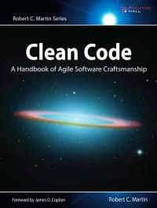

# Clean Code - 2008

> **Clean Code -** *by Robert C. Martin*

# Conteúdo

 - [Clean Code - (Código Limpo)](chapters/clean-code)
 - [Nomes Significativos](chapters/meaningful-names)

---

**REFERENCE:**  
[Clean Code: A Handbook of Agile Software Craftsmanship](https://www.amazon.com/Clean-Code-Handbook-Software-Craftsmanship/dp/0132350882)  

---

**Rodrigo Leite -** *Software Engineer*
