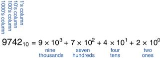

#  Sistema de Numeração

## Conteúdo

 - [01 - Números Decimais](#01)
 - [02 - Números binários](#02)
 - [03 - Números Hexadecimais](#03)
 - **Conversão de Números:**
   - [Convertendo Números Binários em Decimais](#binary-to-decimal)

## 01 - Números Decimais

Na escola primária, você aprendeu a contar e fazer aritmética em **decimal**. Assim como você (provavelmente) tem dez dedos, existem dez dígitos decimais:

> **0**, **1**, **2**,…, **9**.

Os números decimais são chamados de **base 10**. A base é indicada por um subscrito após o número para evitar confusão ao trabalhar em mais de uma base.

Por exemplo, veja a imagem abaixo:

  

A imagem acima mostra como o número decimal **974210** é escrito como a soma de cada um de seus dígitos multiplicada pelo peso da coluna correspondente.

---

## 02 - Números binários

Os bits representam um de dois valores, **0** ou **1**, e são unidos para formar **números binários**. Cada coluna de um **número binário** tem o dobro do peso da coluna anterior, portanto, os números binários têm **base 2**.

Em **binário**, os pesos da coluna (novamente da direita para a esquerda) são:

> **1**, **2**, **4**, **8**, **16**, **32**, **64**, **128**, **256**, **512**, **1024**, **2048**, **4096**, **8192**, **16384**, **32768**, **65536** e assim por diante.

**NOTE:**  
Se você trabalha frequentemente com **números binários**, economizará tempo se lembrar dessas potências de dois até **216**.

Veja a tabela abaixo para ter uma ideia mais visual:

  

---

## 03 - Números Hexadecimais

Escrever longos números binários se torna tedioso e sujeito a erros. Um grupo de quatro bits representa uma de **24 = 16 possibilidades**. Portanto, às vezes é mais conveniente trabalhar na **base 16**, chamada **Hexadecimal**.

Os números hexadecimais usam os seguintes **dígitos** e **letras**:

 - **DIGITOS:** 0, 1, 2 , 3, 4, 5, 6, 7, 8, 9;
 - **LETRAS:** A, B, C, D, E, F.

**NOTE:**  
As colunas na **base 16** têm pesos de **1**, **16**,**162 (ou 256)**,**163 (ou 4096)** e assim por diante.

Veja a tabela abaixo:

|Dígito Hexadecimal|Equivalente Decimal|Equivalente binário|
|------------------|-------------------|-------------------|
|       0          |         0         |        0000       |
|       1          |         1         |        0001       |
|       2          |         2         |        0010       |
|       3          |         3         |        0011       |
|       4          |         4         |        0100       |
|       5          |         5         |        0101       |
|       6          |         6         |        0110       |
|       7          |         7         |        0111       |
|       8          |         8         |        1000       |
|       9          |         9         |        1001       |
|       A          |        10         |        1010       |
|       B          |        11         |        1011       |
|       C          |        12         |        1100       |
|       D          |        13         |        1101       |
|       E          |        14         |        1110       |
|       F          |        15         |        1111       |

---

## Convertendo Números Binários em Decimais

Vamos ver alguns exemplos abaixo de como converter **números binários (base 2)** em **números decimais (base 10)**.

**Exemplo-01:**  
Converta o número binário **101102** em decimal:

  

A matemática aqui é muito simples. Vamos ver novamente, porém, pensando matematicamente:

  

---

**REFERENCE:**  
[Digital Design and Computer Architecture 2nd Edition](https://www.amazon.com/Digital-Design-Computer-Architecture-Harris/dp/0123944244)

---

**Rodrigo Leite -** *Software Engineer*
