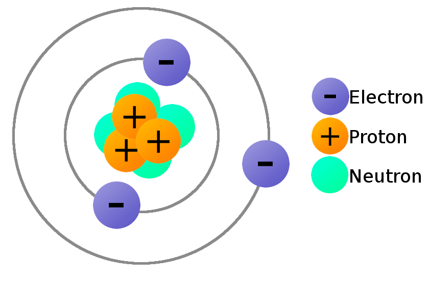
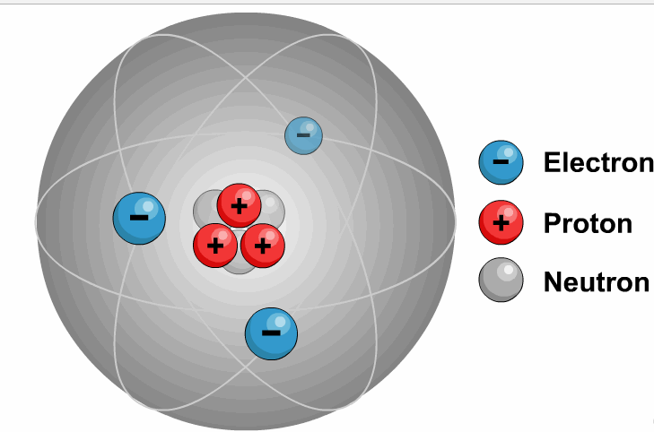
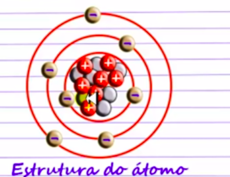
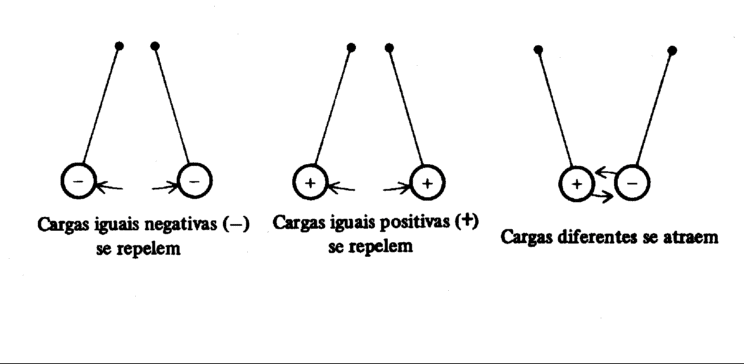
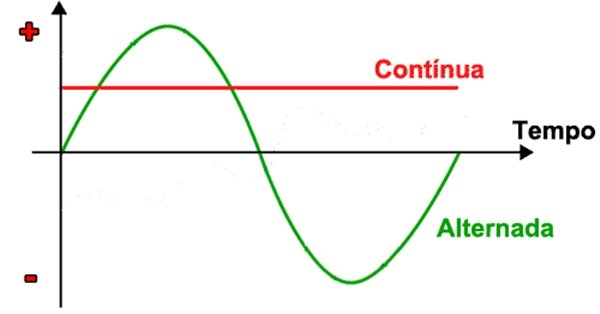

# Electricity Fundamentals

# Contents

 - [01 - Atomic Structure](#01)
 - [02 - Why do electrons revolve around the nucleus?](#02)
 - [03 - What happens when we have an Atom with the same number of protons and electrons?](#03)
 - [04 - Relationship between positive and negative charges (bodies) separately](#04)
 - [05 - Types of Electric Current](#05)

## 01 - Atomic Structure

Well, to understand the nature of electricity we must first understand how an atomic structure (structure of an atom) works.

The **Atomic Structure (structure of an Atom)** is composed of three fundamental particles:

 - **(-) Electrons -** *(with negative charge)*;
 - **(+) Protons -** *(with positive charge)*;
 - **( ) Neutrons -** *(neutral particles)*.

> **All matter is made up of an atom and each chemical element has different atoms.**

Electricity reaches our homes through:

 - Fios;
 - And the movement of negative particles that are part of the electrons, which circulate through the wiimages.

> **At the nucleus of an atom are protons and neutrons and, rotating around that nucleus, are electrons.**

**NOTE:**  
 - Each nucleus of a given chemical element has the same number of protons;
 - This number defines the atomic number of an element and determines its position in the periodic table;
 - In some cases it happens that the same element has atoms with different numbers. These are called isotopes.

## 02 - Why do electrons revolve around the nucleus?

> **The protons attract electrons in their orbits**, so the electrons are rotating around the nucleus that contains the **protons** and **neutrals**.

## 03 - What happens when we have an Atom with the same number of protons and electrons?

See that our **Atom** has the same number of Electrons and Protons.

> When that happens we say that our ***Atom is electrically neutral***.

**NOTE:**  
But, this electrical stability can be changed intentionally! For example, when we intentionally remove electrons from an Atom it becomes - **Positively Charged**.

## 04 - Relationship between positive and negative charges (bodies) separately

We will now see the relationships separately between **Electrons (negative charges)** and **Protons (positive charges)**:

**NOTE:**  
Soon, we return to that theory of topic 02 - **Why do electrons revolve around the nucleus?**  
And as we know, electrons revolve around the nucleus because they are attracted to the protons.

Summing up:

 - **Equal loads -** *Repel*;
 - **Different loads -** *attract*.

## 05 - Types of Electric Current

 - **Direct current -** There is a pole that will always be negative and others that will always be positive:
   - Stacks
   - Batteries
 - **Alternating Current -** Poles vary between negative and positive 60x every second:
   - For example, the energy used in our homes

---

**Rodrigo Leite -** *Software Engineer*
