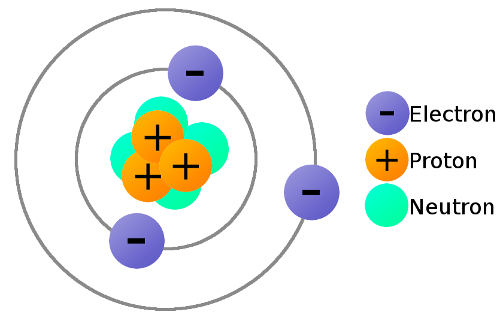

# Introdução à Eletricidade

## Conteúdo

 - [01 - Introdução aos Átomos](#01)
 - [02 - Estrutura de um Átomo](#02)
 - [03 - Tabela Periódica](#03)
 - [04 - Eletrização](#04)
 - [05 - Eletricidade](#05)

## 01 - Introdução aos Átomos

Para começar nosssos estudos sobre **Eletricidade** vale lembrar que tudo no mundo é composto de **Átomos**. Isso mesmo, tudo. Por exemplo:

 - Carros são compostos de Átomos;
 - Animais são compostos de Átomos;
 - Nuvens são compostas de Átomos;
 - Os seres humanos são compostos de Átomos...

Sabendo disso suponha que nós queremos medir o tamanho de um **Átomo**. Para começar vamos pegar uma régua e reservar 1 centimétro:

  

1cm é pouco não acham? Mas comparado com o tamanho de um **Átomo** issso ainda é muito grande. Então, agora vamos dividir esse 1cm por 10:

  

Ótimo, agora nós temos 1 milímetros. Veja essa divisão de forma visual abaixo:

  

> Ok, então agora já temos o tamanho de um **Átomo**? Infelizmente não!  

Agora vamos tentar dividir esse milímetro por mil partes iguais, vai ficar assim:

  

> Ou seja, agora nós temos **1 micrômetro**. Ótimo, esse é o tamanho de um **Átomo**? **NÃO!!**  

Então, vamos dividir esse **1 micrômetro** por mil partes iguais, vai ficar assim:

  

Lindo! Agora nós temos **1 Nanômetro**, mas isso ainda é muito grande se comparado com o tamanho de um **Átomo**. Então o que fazer?  
Vamos dividir esse Nanômetro novamente por mil partes iguais:

  

Então, agora nós temos **1 picômetro** e é essa unidade de medida que tem os **Átomos**.

> **ALGUNS PICÔMETROS**.

Bem, até o momento não temos nenhum mecânismo que nos possibilite ver um **Átomo** *(nem mesmo um microscópio)*. Mas se isso fosse possível e nós quiséssemos ver os **Átomo** de um prego nós enxergaríamos algo parecido com isso:

  

  

Veja que o *prego* é composto de vários **Átomos**.

---

## 02 - Estrutura de um Átomo

Ok, agora que nós sabemos que um **Átomo** é extremamente pequeno, vamos ver como é composto um **Átomos** e sua estrutura:

  

Veja que um **Átomo** é composto de:

 - **Um Núcleo com:**
   - **Prótons -** Com cargas *Positivas*;
   - **Nêutrons -** Com cargas *Neutras*;
 - **Elétrons** - Com cargas *Negativas*.

---

## 03 - Tabela Periódica

**NOTE:**  
Vale lembrar que na natureza existem vários materiais diferentes. Por exemplo, veja a Tabela Periódica com esses vários materiais (elementos):

  

Veja que cada material (elemento) nós temos o número Atômico relacionado.

> **MAS O QUE É ESSE NÚMERO ATÔMICO?**

Esse número Atômico nada mais é do que o número de **Elétrons** que tem esse material (elemento). Por exemplo, o ferro **(Fe/Iron)** tem **26 Elétrons**.

## 04 - Eletrização

Voltando para os **Átomo**, um conceito bem importante é o de **Eletrização**. Vamos voltar para o exemplo do material (elemento) Ferro que tem como número atômico 26.

 - **Isso signifca que o Ferro (Iron) tem:**
   - **26 Elétrons** (Cargas negativas);
   - **26 Protons** (Cargas positivas).

**NOTE:**  
O problema é que elétrons de um material (elemento) não são constantes, ou seja, um material (elemento) pode ganhar ou perder elétrons.

**NOTE:**  
Um exemplo é quando um **Átomo** perde alguns de seus **elétrons** deixando o Átomo com uma *carga positiva*; Ou quando um Átomo ganha mais elétrons do que ele necessita deixando o com uma *carga negativa*.

Veja o exemplo abaixo para ficar mais claro visualmente:

  

## 05 - Eletricidade

Agora para entender melhor como realmente funciona a Eletricidade suponha que nós temos dois materiais:

 - Um com uma carga negativa;
 - E outro com uma carga positiva...

Agora vamos ligar esses dois materiais com algum material condutor. **Por exemplo um fio**.  
O que vai acontecer é que os elétrons que estão sobrando na carga negativa vão passar para a carga positiva.

Veja o exemplo abaixo para ficar mais claro:

  

> Esse é um fenômeno da natureza, não do homem!

**NOTE:**  
Mas o mais importante aqui é que você saiba é que quando estamos passando elétrons da carga negativa para a positiva isso gera energia. Ou seja, esse é um processo que pode gerar *eletricidade*.

Por exemplo, uma tomada elétrica sempre vai ter no **mínimo dois pinos**:

  

 - Um pino vai ter uma carga positiva;
 - E o outro uma carga negativa.

Outro exemplo são as **pilhas** e **baterias**:

  

Se você prestar atenção vai ver que as **pilhas** e **baterias** vão ter dois lados:

 - **(+) - Energizado positivamente;**
 - **(-) Energizado negativamente.**

---

**Rodrigo Leite -** *Software Engineer*
