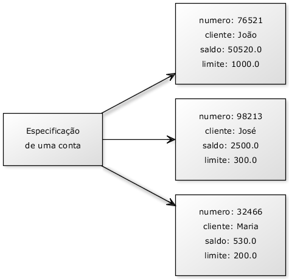
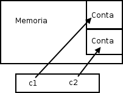
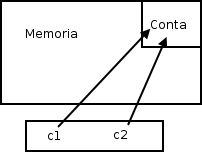

# Basic Object Orientation

# 01 - Creating a Type

Consider a bank program, it is quite easy to see that an extremely important entity for our system is the **Account**. Our idea here is to generalize some information along with features that every **Account** should have.

What does every account have and is important to us?

 - Account number;
 - Name of the Account holder;
 - Balance...

What does every Account do and is important to us?

> **That is, what would we like to "ask the account"?**

 - Take a quantity x;
 - Deposit amount x;
 - Prints the name of the account holder;
 - Return current balance;
 - Transfers amount x to another account y;
 - Return account type...

With this, we have the design of a bank account. Can we take this project and access its balance? No. What we still have is the project. Rather, we need to build an **Account** so we can access what she has, and ask her to do something.



# 02 - A "class" in Java

Let's start with just what one **Account** has, not what it does (we'll see next). Such a type, as specified **Account** above, can easily be translated into Java:

```java
class Account {
  int number;
  String holder;
  double balance;
}
```

For now, we declare what every account should have. These are the **attributes** that every account, when created, will have. Note that these variables were declared outside a block, different from what we did when we had that main.

> When a variable is declared directly within the scope of the class, it is called an object variable, or **attribute**.

# 03 - Creating and Using an Object

We already have a Java class that specifies what every object in this class should have. But how to use it? In addition to this class, we will still have **Program.java** and from it we will use the **Account** class.

To create (build, instantiate) one Conta, just use the keyword ***new***:


```java
class Program {
  public static void main(String[] args) {
    new Account();
  }
}
```

Well, the code above creates an object of type Conta, but how to access this object that was created? We need to have some way of referring to this object. We need a **variable (reference)**:

```java
class Program {
  public static void main(String[] args) {
    // Reference for Account class.
    Account myAccount;
    myAccount = new Account();
  }
}
```

It may seem strange to write twice *Account**:

 - Once in the **reference** variable declaration;
 - And once in the use of **new**.

But there is a reason, which we will soon understand...

Through the variable **myAccount (reference)**, we can access the newly created object to change yours *holder*, yours *balance*, etc:

```java
class Program {
  public static void main(String[] args) {
    // Reference for Account class.
    Account myAccount;
    myAccount = new Account();

    // Setter atributes values.
    myAccount.holder = "Rodrigo";
    myAccount.balance = 1000.0;
  }
}
```

# 04 - Methods

Within the class, we will also declare what each account does and how it is done - the behaviors each class has, that is, what it does. For example, how does an Account withdraw money? We will specify this within the class itself Account, not in an unrelated location of the Account information itself.

> This is why these "functions" are called **methods**. For it is the way to do an operation with an object.

We want to create a method that **takes** a certain **amount** and returns **no information** to anyone who triggers this method:

```java
class Account {
  int number;
  String holder;
  double balance;

  void withdraw(double quantity){
    double newBalance = this.balance - quantity;
    this.balance = newBalance;
  }
}
```

> The key word **void** says that when you ask the account to withdraw an amount, no information will be sent back to the orderer.

Similarly, we have the method to **deposit** some amount:

```java
class Account {
  int number;
  String holder;
  double balance;

  void withdraw(double quantity){
    double newBalance = this.balance - quantity;
    this.balance = newBalance;
  }

  void deposit(double quantity){
    this.balance += quantity;
  }
}
```

> To send a message to the object and ask it to execute a method, we also use the **dot ( . )**. The term used for this is **method invocation**.

The following code withdraws money and then deposits another amount into our Account:

```java
public class TestMethods {
  public static void main(String[] args) {

    Account myAccount; // Reference variable.
    myAccount = new Account(); // Instance Account Object.

    myAccount.holder = "Rodrigo";
    myAccount.balance = 1000.0;

    myAccount.withdraw(500);
    myAccount.deposit(1000);
    System.out.println(myAccount.balance);
  } 
}
```

Since your initial balance is 1000 reals, if we withdraw 500, deposit 1000 reals and print the balance, what will be printed?

> **1.500**

# 05 - Return Methods

> A method always has to define what returns, nor that there is no return, as in the previous examples where we were using **void**.

A method can return a value for the code that called it. In the case of our method withdraw, we can return a **boolean** value indicating whether the operation was successful.

# 06 - Objects Are Accessed by References

> When we declare a variable to associate with an object, in fact, that variable does not store the object, but rather a way to access it, called a **reference**.

**Example:**  
```java
Account myAccount; // Reference variable.
```

This is why, unlike primitive types like **int** and **long**, we need to give **new** after declaring the variable:

```java
public static void main(String[] args) {
  Account c1; // Reference variable.
  c1 = new Conta(); // Instance Account Object.

  Account c2; // Reference variable.
  c2 = new Conta(); // Instance Account Object.
}
```

**NOTE:**  
 - The correct thing here is to say that **c1** it refers to an object
 - It is not correct to say that **c1** is an object

**c1** is a variable reference, though, after a while, Java programmers speak **"I have a c object type Account"**, but only to shorten the phrase **"I have a reference c a object type Account"**.

> Just remember that in Java, **a variable is never an object**. There is no way in Java to create what is known as a "stack object" or "local object" - **because every object in Java, without exception, is accessed by a reference variable**.

This code leaves us in the following situation:



Internally, **c1** and **c2** will save a number that identifies which memory location that **Account** is. That way, when we use the **"."** to navigate, Java will access the Account one in that memory location, not another one.

**IMPORTANT NOTE:**  
> For those who know it, it is **similar to a pointer**, but you cannot manipulate it as a number or use it for arithmetic, it is typed.

Another example:

```java
/**
* Rodrigo Leite - Software Engineer
* 19/12/2019
*/
public class TestReference {

  public static void main(String[] args) {

    Account c1; // Reference variable.
    c1 = new Account(); // Instance Account Object.
    c1.deposit(100);

    // Passes the memory address saved in reference variable c1 to c2.
    Account c2 = c1;
    c2.deposit(200);

    System.out.println(c1.balance);
    System.out.println(c2.balance);
  }
}
```

> What happens here? The operator **=** copy the value of a variable. But what is the value of the variable **c1**? Is it the object? No. In fact, the stored value is the reference **(address)** where the object is in main memory.

In memory, what happens in this case:

```java
Account c1 = new Account();
Account c2 = c1; // Passes the memory address saved in reference variable c1 to c2.
```



**IMPORTANT NOTE:**  
> When we did **c2 = c1**, **c2** it now references the same object it **c1** references at that time.

**Rodrigo Leite -** *Software Engineer*
